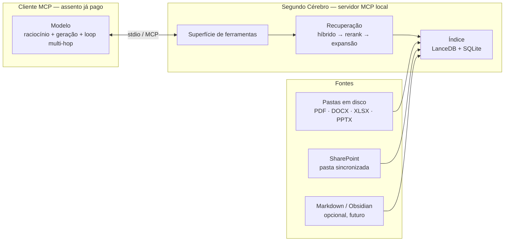

# Arquitetura — Segundo Cérebro RAG

> Documento de decisões. Atualizar quando uma escolha mudar, registrando o motivo.

---

## 1. Objetivo e restrições

Sistema de recuperação sobre uma base de conhecimento pessoal/corporativa —
**pastas soltas em disco no Windows, com PDF, DOCX, XLSX e PPTX dominando** —
consumível por qualquer modelo, com **custo marginal zero** e sem dependência de
um fornecedor de LLM.

> Este parágrafo dizia "vault Obsidian + PDFs + documentos" até 29/08/2026, e a
> premissa está errada: **não há Obsidian instalado e não há wikilinks.** O
> `CLAUDE.md` já marcava o mal-entendido — ele custou uma discussão — e a linha
> que o causava continuava aqui, no primeiro parágrafo do documento de decisões.
> É o padrão *"premissa corrigida num lugar segue circulando no outro"*, o mesmo
> das três grafias da cobertura do dourado. O Obsidian foi **deliberadamente não
> adotado**: ele não acrescenta nada sobre uma pilha de arquivos Office. Se
> entrar depois, wikilink é sinal *adicional*, nunca o principal — que é o que a
> restrição `R5` abaixo já dizia.

Restrições declaradas:

| # | Restrição | Consequência de projeto |
|---|-----------|-------------------------|
| R1 | Model agnostic **depois de construído** | A fronteira do sistema é um protocolo, não um SDK |
| R2 | Sem custo variável de API | Nenhuma etapa por-consulta pode chamar API paga |
| R3 | Superar limites do RAG tradicional em **precisão** | Híbrido + reranking + expansão de contexto |
| R4 | Superar limites em **raciocínio multi-hop** | Ferramentas componíveis, não pipeline fixo |
| R5 | Integrar com second brain | Estrutura de **pastas** é sinal de primeira classe; wikilinks são bônus futuro, não requisito |
| R6 | Pessoal primeiro, empresa depois | Núcleo reutilizável, duas portas de entrada |

**Nota sobre Obsidian.** Um "vault" é um diretório com arquivos markdown — não é
conta nem produto. O Obsidian **não é dependência** e **não é fonte**: o acervo
continua sendo pastas em disco (pessoal) e SharePoint (corporativo), sem
wikilink na entrada. O `J.e` (02/09/2026) traz o Obsidian como *saída*: um
comando explícito (`py -m segundocerebro.acesso.exportar`) grava uma view
one-way fora das raízes, com `[[wikilinks]]` derivados da tabela `mencoes`.
Nada do vault volta para o acervo nem para o índice. Wikilink no acervo
continuaria sendo sinal *adicional*, nunca o principal.

---

## 2. Decisão central: MCP server, não aplicação

O sistema **não tem interface de chat e não gera texto**. Ele expõe ferramentas
de recuperação via Model Context Protocol. O cliente (Claude Code, Antigravity,
Grok, Claude Desktop, Cursor) fornece o modelo, o loop de agente e a UI.



### Por que isso satisfaz R1 e R2 simultaneamente

MCP é a camada de abstração — e ela é **um padrão externo, não um wrapper que
você mantém**. Trocar de modelo é trocar de cliente. Nenhuma linha do servidor
muda.

E como a geração roda no cliente, o custo variável desaparece por completo:

| Etapa | Volume | Onde roda | Custo |
|-------|--------|-----------|-------|
| Embeddings (indexação) | Todo o corpus, a cada reindexação | Local (`e5-large`) | $0 |
| Busca híbrida | Toda consulta | Local | $0 |
| Reranking | ~50 candidatos/consulta | Local (cross-encoder) | $0 |
| Raciocínio e geração | 1 loop/consulta | Cliente (assento) | Já pago |

Isso não é uma otimização marginal. Embeddings e reranking são as etapas de
**alto volume** — rodam sobre o corpus inteiro e sobre cada consulta. Geração é
a de baixo volume. Colocar as duas primeiras localmente elimina ~100% do que
seria a conta de API.

### Por que isso resolve R4 de graça

Multi-hop **não é implementado**. Recuperação agêntica é, por definição, um
modelo chamando ferramentas de busca em loop, refinando e verificando. O
cliente já faz isso nativamente. O servidor só precisa oferecer primitivas
componíveis:

```
Pergunta: "que riscos ambientais apareceram nas atas depois da mudança de escopo?"

  search("mudança de escopo")        → acha a ata de decisão, 12/03
  read_note(ata_12_03)               → lê a decisão completa
  list_recent(since=2026-03-12)      → atas posteriores
  search("risco ambiental", after=…) → filtra pelo recorte temporal
  neighbors(nota_risco)              → puxa notas ligadas por [[wikilink]]
```

Um pipeline multi-hop codificado escolheria uma sequência fixa. O modelo escolhe
por pergunta — e melhora sozinho quando o modelo do cliente melhora.

### Bases: uma instalação, vários acervos

*Decidido em 14/08/2026.* Uma instalação atende **N bases**, cada uma com suas
raízes, seu índice, sua configuração de recuperação e seu servidor MCP. O caso
que motivou: pastas pessoais e pastas de trabalho no mesmo computador, e o
controle de qual agente alcança qual acervo.

**A separação é física, não um filtro.** Cada base tem seu próprio diretório de
índice — LanceDB e `registro.db` separados — e sobe como um processo de servidor
MCP próprio:

```
config.toml ──┬── base "pessoal"   → index/pessoal/   → servidor segundocerebro-pessoal
              └── base "trabalho"  → index/trabalho/  → servidor segundocerebro-trabalho
```

A alternativa barata seria um índice só com a base como metadado e um filtro na
consulta. Ela está **descartada**, pelo mesmo argumento que a seção 6 já usa para
ACL: filtrar depois vaza existência e conteúdo em ranking. Um filtro é um booleano
que pode estar errado — por bug, por parâmetro default, por uma consulta que
esqueceu de passá-lo. Dois diretórios não vazam um no outro porque o servidor de
trabalho **não tem** a tabela pessoal aberta. Para uma fronteira cuja violação é
irreversível — conteúdo pessoal exposto a um agente corporativo, ou o contrário —
a garantia estrutural vale o custo do disco duplicado.

Registrado porque é o atalho tentador: o índice já grava `raiz` por documento
(`store.py`). Esse campo é **procedência**, e reaproveitá-lo como fronteira de
isolamento é exatamente a versão filtrada que este parágrafo recusa.

**Dois modos de isolamento, e só um é garantia:**

| Modo | Como | O que garante |
|------|------|---------------|
| **Por registro** | O cliente registra só a base daquele contexto | Garantia dura. O agente não enxerga a outra base porque a ferramenta não existe na sessão dele |
| **Por descrição** | O cliente registra as duas; o modelo escolhe pela `instructions` de cada servidor | Conveniência. O modelo *tende* a acertar, e tendência não é fronteira |

Consequência de projeto: a `instructions` do servidor e a descrição das
ferramentas passam a ser **funcionais**, não cosméticas — são o único sinal pelo
qual o modelo roteia no modo por descrição. Hoje estão fixas no código; passam a
vir da base.

**O que decorre disso:**

- **Os pesos de recuperação são por base, por necessidade.** A premissa do painel
  de ajuste é que a configuração certa depende do acervo; notas pessoais e
  contratos corporativos são acervos diferentes. Uma base cheia de código de
  contrato quer mais bm25; uma base de texto corrido quer mais denso
- **Métrica é por base.** Recall médio entre dois acervos não mede nada. O
  conjunto dourado ganha o campo `base`, e nenhum relatório agrega as duas
- **O modelo de embedding é por base.** Uma base pessoal pequena pode rodar
  `MiniLM` enquanto a corporativa roda `e5-large` — no corpus real medido, ~31 h
  contra ~114 h.
  O cache `models/` é compartilhado: nenhum download duplicado
- **Custo de processo, mitigado pelo que já existe.** Cada base em uso é um
  processo com seu encoder em memória. A carga preguiçosa já implementada
  (`Recursos.busca` abre o índice na primeira consulta, não na importação) faz
  uma base registrada e não usada custar zero
- **Ids são únicos dentro da base.** A base faz parte do endereço. `read_note`
  no servidor pessoal não resolve id do trabalho — comportamento correto, não
  defeito
- **Governança fica mais simples, não mais complexa.** O acervo de um cliente sai
  inteiro quando o contrato acaba: apagar um diretório. Política de backup e
  cifragem por base, sem varrer o índice atrás do que pertence a quem.
  O `FND-08b` entrega o backup do **índice** (registro + vetores) com trava
  exclusiva e restauração para diretório novo; originais da pasta apontada não
  entram (`docs/backup-indice.md`)

**Migração: nenhuma reindexação.** O índice atual vira uma base apontando para o
diretório `index/` que já existe. Bases novas nascem vazias e são indexadas
quando o usuário quiser.

Isto **não** antecipa a F5. Bases são um usuário com vários públicos; a ACL da
F5 é vários usuários dentro de uma base, com permissão por documento. As duas
compõem: a base é a fronteira grossa e barata, a ACL é a fina e cara.

---

## 3. Camadas

### Camada 1 — Ingestão

**Formatos** — a realidade das fontes é Office e PDF, não markdown. Ordem de
prioridade real:

| Formato | Ferramenta | Nota |
|---------|-----------|------|
| PDF | `pymupdf4llm` → markdown | Preserva seções. PDF escaneado precisa de OCR (fora de escopo inicial) |
| DOCX | `python-docx` | Headings reais viram hierarquia |
| XLSX | `openpyxl` | Uma linha ≠ um chunk. Aba + cabeçalho + faixa de linhas como unidade |
| PPTX | `python-pptx` | Slide = unidade; título do slide é o heading |
| MSG / EML | `olefile` (só o container) + camada MAPI própria; `email` da stdlib para MIME | Assunto, remetente, data e **nome do anexo** são metadados fortes. O corpo é partido por mensagem da thread, senão a decisão que importa fica diluída no histórico citado. `extract-msg` traria seis pacotes transitivos para fazer a metade que é tabela de nomes de stream |
| Markdown | nativo | Frontmatter, `#tags`, `[[wikilinks]]` **se existirem** |
| DOC / XLS / PPT legado | `olefile` + `xlrd` sobre bytes | Extração mais pobre que OOXML; sem COM. Fila de indexação: [`docs/prioridade-de-indexacao.md`](docs/prioridade-de-indexacao.md) |

**Fontes**

*Pessoal — pastas em disco.* Caso simples: lista de raízes configuradas, com
padrões de exclusão (`~$*`, `.tmp`, `node_modules`, pastas de backup).

*Corporativo — SharePoint.* Duas rotas, e a escolha importa:

| Rota | Custo de setup | Quando |
|------|---------------|--------|
| **Pasta sincronizada** (cliente OneDrive) | Zero. Vira caminho local. | **Fase inicial.** Sem envolver TI. |
| **Microsoft Graph API** | Registro de app no Entra ID + consentimento de admin (`Sites.Selected`, de preferência — escopo por site, não por tenant) | F5, quando for serviço multiusuário |

> ⚠️ **Armadilha do Files On-Demand.** Numa pasta sincronizada, arquivos podem ser
> *placeholders* que não estão em disco. **Ler o conteúdo dispara o download.** Um
> indexador ingênuo percorrendo a biblioteca inteira baixa tudo — potencialmente
> centenas de GB — e desfaz a economia de espaço. Indexadores de terceiros
> costumam errar nisso.
>
> Mitigação obrigatória: checar os atributos de arquivo de nuvem
> (`FILE_ATTRIBUTE_RECALL_ON_DATA_ACCESS`, `FILE_ATTRIBUTE_OFFLINE`) **antes** de
> abrir, e tornar a política explícita e configurável — *pular* placeholders, ou
> hidratar sob limite de volume declarado. Nunca hidratar por acidente.

*Governança da fase corporativa inicial:* o índice herda **o seu** nível de
acesso e por isso não pode ser compartilhado. Indexar somente o que você já pode
ler, manter o índice local, e não expor a nenhum outro usuário até o trabalho de
ACL da F5. LGPD se aplica ao índice como se aplica aos documentos.

**Grafo derivado — o substituto dos wikilinks**

Sem Obsidian não há links manuais. Em vez de esperar por eles, o grafo é
**extraído automaticamente** — o que serve melhor a este caso, porque não depende
de ninguém manter links à mão:

| Sinal | De onde vem |
|-------|-------------|
| Taxonomia | Caminho de pastas. Estrutura corporativa já codifica projeto / ano / tipo — é metadado de graça |
| Convenção de nome | Padrões em nomes de arquivo (data, código, versão) |
| Temporal | Datas de criação e modificação |
| **Identificadores** | Números de contrato, códigos de projeto, siglas, processos — extraídos por regex + glossário. Dois documentos que citam o mesmo contrato ficam ligados |
| Entidades | Nomes de pessoas e organizações recorrentes |

É isso que alimenta `neighbors` e, por consequência, o multi-hop.

**Watcher** (`watchdog`): reindexação incremental por hash de arquivo.

**Chunking adaptativo por estrutura, não por tamanho fixo:**

| Situação | Estratégia |
|----------|-----------|
| Nota curta (< ~600 tokens) | Nota inteira = 1 chunk |
| Nota longa | Split por heading, um chunk por seção |
| Seção longa demais | Split com overlap, mantendo o heading |
| PDF | Split por seção detectada, fallback para páginas |

**Cabeçalho contextual obrigatório.** Todo chunk é embeddado com o caminho de
headings prefixado:

```
Projeto Rodoanel > Riscos > Ambientais
---
O licenciamento da faixa norte depende de...
```

Barato de implementar, e um dos maiores ganhos de precisão disponíveis — resolve
o caso em que o chunk sozinho é ambíguo ("depende de..." depende de quê?).

**Metadados por chunk:** arquivo de origem, caminho de headings, wikilinks de
saída, tags, frontmatter, datas de criação/modificação, tipo de documento.

**Arquivo hostil e `except Exception`.** Uma pasta que nunca vimos tem arquivo
hostil de sobra — PDF truncado, OLE que mente, extra opcional ausente, sensor
que esta máquina não tem. Falhar é aceitável; travar a passada ou indexar como
se o documento tivesse texto, não. `except Exception` só é permitido em três
casos:

| Caso | Onde | O que não pode |
|------|------|----------------|
| **(a) Borda de arquivo hostil** | parsers, `reader.parse_file`, conversão legado | Engolir a exceção e seguir como `OK`. O `ParseStatus` fica gravado (`ERROR`, `UNSUPPORTED`, `EMPTY`, …) e o log carrega o tipo e a mensagem reais |
| **(b) Laço de onda que não pode morrer** | indexador, OCR por página, worker de GPU | Um arquivo derrubar os outros. Log + status; a passada segue |
| **(c) Probe de hardware ou import opcional** | CUDA, psutil, extra `[ocr]`, caps do gerador | Um sensor ausente abortar a indexação. Sentinela (`None`, `0`, `False`) é resposta válida da probe |

Fora desses três, estreitar o `except` ao tipo. No caminho de consulta MCP
(`mcp/server.py`, `retrieve/`) a exceção ou é tipada (`ErroDeConfig` e irmãs)
ou sobe — nunca vira lista vazia. Cada `# noqa: BLE001` leva o motivo depois
de um travessão (`—`); a suíte recusa o sufixo ausente
(`tests/test_politica_excecoes.py`).

### Camada 2 — Índice

| Componente | Escolha | Motivo |
|------------|---------|--------|
| Vetores | **LanceDB** | Arquivo local, sem servidor, híbrido nativo, filtro por metadado, Python-first |
| Grafo e metadados | **SQLite** | Links, backlinks, tags, registro de documentos, linhagem de chunks |
| Embeddings | **`e5-large` + BM25** | A correção de 12/08, abaixo. O plano era BGE-M3 |

> ⚠️ **Correção de 12/08/2026 — o `fastembed` não suporta BGE-M3.** Ao instalar
> (versão 0.8.0) e listar os modelos disponíveis, os densos são todos ingleses
> (`bge-base-en`, `bge-small-en`, …) e os esparsos também (SPLADE inglês, BM25,
> BM42). Não existe BGE-M3 no catálogo, nem denso nem esparso. A frase abaixo
> descrevia uma capacidade que a biblioteca não tem.
>
> **Substituição adotada**, mantendo as invariantes (local, sem API, português):
>
> | Papel | Escolha | Por quê |
> |-------|---------|---------|
> | Denso | `intfloat/multilingual-e5-large` (1024 dim, 2,24 GB, ONNX) | Multilíngue de verdade, licença MIT, roda em CPU |
> | Esparso | `Qdrant/bm25` (10 MB) | Casamento lexical exato: siglas, códigos de contrato |
>
> Foi descartado o `jinaai/jina-embeddings-v3`, tecnicamente atraente (8192
> tokens de contexto e adaptadores separados para consulta e passagem), porque a
> licença é CC BY-NC — **não comercial**. Verificar antes de qualquer
> reconsideração; para uso corporativo isso é impedimento, não detalhe.
>
> **Duas consequências que não são cosméticas:**
>
> 1. **O esparso deixa de ser aprendido.** BM25 pesa termos por frequência, não
>    por relevância aprendida. Para código de contrato e sigla — o caso que
>    justifica o esparso — BM25 resolve bem. Para vocabulário próximo mas não
>    idêntico, perde do BGE-M3.
> 2. **A janela do e5-large é de 512 tokens**, não 8192. Chunk de 2500
>    caracteres (~625 tokens) seria truncado. `ChunkConfig.max_chars` precisa
>    cair para ~1600, o que aumenta a contagem de chunks — a medir.
>
> **Rota de volta**, se o eval mostrar que a substituição custa precisão: BGE-M3
> de verdade via `FlagEmbedding`, que é PyTorch em vez de ONNX (torch pesa ~2,5
> GB e a inferência em CPU é mais lenta). A decisão fica para quando houver
> número, não agora.
>
> ### Segunda correção, mesma data: a vazão em CPU não fecha
>
> Medido nesta máquina (i7-1355U, 12 threads, 15 W, sem GPU CUDA), sobre 40
> chunks reais do acervo, `threads=10`:
>
> | Modelo | dim | chunks/s | Indexar 79 mil chunks |
> |--------|----:|---------:|----------------------:|
> | `intfloat/multilingual-e5-large` | 1024 | 0,63 | **34,9 h** |
> | `paraphrase-multilingual-mpnet-base-v2` | 768 | 2,10 | **10,5 h** |
> | `paraphrase-multilingual-MiniLM-L12-v2` | 384 | 13,22 | **1,7 h** |
>
> `batch_size` não muda nada (16 e 64 dão o mesmo), e `threads=10` rende só +26%
> sobre o padrão: o gargalo é compute por token, não paralelismo nem overhead de
> lote.
>
> **A escolha do modelo passou a ser imposta pelo hardware, não pela qualidade.**
> Isso é uma restrição nova do projeto e merece estar escrita: um notebook de 15 W
> não roda um encoder de 560M parâmetros sobre 79 mil chunks em tempo útil.
>
> Decisão operacional: `MiniLM-L12` (384 dim) como padrão de desenvolvimento,
> porque 1,7 h permite reindexar e iterar. O modelo é **configurável**, e a
> escolha final sai da ablação no eval sobre o corpus estreito de 434 documentos,
> onde indexar custa minutos em vez de horas.
>
> ### Correção de 15/08/2026 — a coluna de horas subestima em ~3×
>
> As taxas medidas acima (0,63 · 2,10 · 13,22 chunks/s) continuam válidas: são
> banco de ensaio do **encoder isolado**. A coluna "Indexar 79 mil chunks" é que
> não sobrevive ao contato com o corpus, por dois motivos independentes:
>
> 1. **O corpus não tem 79 mil chunks.** Com 39% dos documentos indexados já são
>    77.441; extrapolando pela média de 67,8 chunks por documento, o total fica
>    em **~196 mil**. A estimativa de 79 mil saiu do corpus estreito
> 2. **A coluna ignora o parse.** Fim a fim são 2,09 s por chunk, dos quais 1,59 s
>    de embedding e **0,50 s de parse, chunking e SQLite**
>
> Medido no run em curso: **1.721 chunks/h**, ou seja ~114 h para o corpus
> completo com `e5-large` — não 34,9 h.
>
> | Modelo | s/chunk (encoder) | + 0,50 s de parse | Corpus completo (~196 mil) |
> |--------|------------------:|------------------:|---------------------------:|
> | `e5-large` | 1,587 | 2,09 | **~114 h** |
> | `mpnet` | 0,476 | 0,98 | **~53 h** |
> | `MiniLM-L12` | 0,076 | 0,58 | **~31 h** |
>
> O MiniLM revela o ponto que a tabela antiga escondia: com ele a indexação passa
> a ser **limitada pelo parse**, não pelo encoder — 0,076 s contra 0,50 s. Trocar
> para um modelo 21× mais rápido rende 3,6× no relógio. É a mesma conta de
> Amdahl da seção 4, e o mesmo argumento a favor do pipeline.
>
> Opções não exploradas, registradas para não se perderem: quantização int8 do
> ONNX (2 a 4× esperado, sem modelo multilíngue quantizado pronto no catálogo),
> `openvino`/`directml` para usar a iGPU Intel, e rodar a indexação inicial em
> máquina mais forte, guardando só o índice.
>
> ### Janela de 512 tokens: medida em português
>
> 4,49 caracteres por token no corpus real. Ou seja 512 tokens ≈ **2.298
> caracteres**, abaixo do `max_chars=2500` do chunker — e o p90 dos chunks bate
> exatamente em 512, o que significa que **cerca de 10% já estavam sendo
> truncados em silêncio**. `max_chars` cai para 1.800, com margem para o
> cabeçalho contextual que é prefixado ao texto.
>
> **Correção de 13/08/2026 — este parágrafo leu o sintoma como confirmação.**
> Um p90 que bate *exatamente* em 512 não é distribuição de texto: é saturação. O
> tokenizador vinha com truncagem ligada e `encode()` devolvia no máximo a
> janela, então a contagem era incapaz de reportar qualquer valor acima dela. Os
> "10% truncados em silêncio" eram, na verdade, **62,3% dos chunks acima da
> janela real do modelo, com só 19,3% do texto chegando ao vetor**. O número
> 4,49 caracteres por token continua válido. A conclusão sobre `max_chars` não —
> ela foi tirada de uma medição saturada. Ver `docs/truncagem-silenciosa.md`.
>
> Vale o método: o dado estava na mesa em 11/08 e a leitura confirmatória custou
> dois dias de medições sobre um índice defeituoso. Valor redondo demais em
> percentil é suspeito de teto, não de coincidência.

**O plano original era o BGE-M3.** A correção de 12/08, acima, substituiu isso
por `e5-large` denso e BM25. O parágrafo fica como o plano que não coube no
`fastembed`. Um único modelo produziria três
representações no mesmo forward pass:

- **Dense** — semântica
- **Sparse (lexical)** — casamento exato de termos: siglas, códigos de contrato,
  nomes próprios, números de processo
- **Multi-vector (ColBERT)** — reservado, se precisarmos de mais precisão

O plano dava busca híbrida sem índice BM25 separado. Para contexto corporativo
com siglas e códigos, a componente esparsa aprendida não seria opcional. 568M
parâmetros, 100+ idiomas (incluindo português), entrada de até 8192 tokens, em
CPU. O produto ficou com `e5-large` e BM25/FTS5, não com esse modelo.

### Camada 3 — Recuperação (onde a engenharia de R3 acontece)

```
1. Entendimento da consulta
   expande siglas via glossário; extrai filtros (data, tag, fonte)

2. Recuperação híbrida
   dense (`e5-large`) + lexical (BM25/FTS5) → fusão RRF → top ~50

3. Reranking  ← opcional, desligado por padrão
   cross-encoder local (bge-reranker-v2-m3) → top ~8

4. Expansão de contexto
   devolve a seção completa e chunks vizinhos, não o chunk cru
   (elimina o caso "a resposta estava no parágrafo seguinte")

5. Expansão pelo grafo derivado
   opcionalmente puxa documentos a 1 hop — mesmo contrato, mesmo projeto,
   mesma pasta, wikilink (se houver)
```

Bi-encoder para revocação, cross-encoder para precisão. O reranker vê o par
(consulta, documento) junto e por isso julga relevância muito melhor que
similaridade de cosseno — é a diferença entre "top-50 contém a resposta" e
"top-5 contém a resposta".

> ⚠️ **Correção de 16/08/2026 — o `bge-reranker-v2-m3` não está no `fastembed`.**
> Ele é nomeado neste documento e no ROADMAP desde o início. Ao listar o catálogo
> do `TextCrossEncoder` (0.8.0), não está lá. É **exatamente** o erro que já
> custou dois dias com o BGE-M3 denso, repetido: escrever o plano com o nome de
> um modelo sem conferir se a biblioteca o serve.
>
> O catálogo inteiro, e por que sobra um:
>
> | Modelo | Tamanho | Licença | Serve |
> |---|---|---|---|
> | `Xenova/ms-marco-MiniLM-L-6-v2` | 0,08 GB | apache-2.0 | Não — MS MARCO é inglês |
> | `Xenova/ms-marco-MiniLM-L-12-v2` | 0,12 GB | apache-2.0 | Não — inglês |
> | `jinaai/jina-reranker-v1-tiny-en` | 0,13 GB | apache-2.0 | Não — inglês |
> | `jinaai/jina-reranker-v1-turbo-en` | 0,15 GB | apache-2.0 | Não — inglês |
> | `jinaai/jina-reranker-v2-base-multilingual` | 1,11 GB | **cc-by-nc-4.0** | Não — **não comercial** |
> | **`BAAI/bge-reranker-base`** | 1,04 GB | **mit** | **Único candidato** |
>
> O jina multilíngue cai pelo mesmo critério que reprovou o `jina-embeddings-v3`
> como denso, e a consistência importa: licença não comercial é impedimento para
> o uso corporativo da F5, não detalhe a resolver depois.
>
> `bge-reranker-base` tem espinha XLM-RoBERTa base (~278M), então é multilíngue
> por construção — mas o treino é enviesado para chinês e inglês, e **a qualidade
> em português está por medir**. Duas coisas ficam pendentes de número, e nenhuma
> das duas pode ser suposta:
>
> 1. **Qualidade** no conjunto dourado, contra a fusão sem rerank.
> 2. **Latência.** Cross-encoder custa por par, e o par é caro: o `e5-large`
>    (560M) faz 0,63 chunk/s nesta máquina. Se o reranker de 278M fizer ~1,3
>    par/s, reranquear 25 candidatos custa ~20 s **por consulta** — inviável para
>    uso interativo, mesmo sendo local e de graça. O número de candidatos é o
>    botão, e pode ser que o botão não tenha posição boa neste hardware.
>
> **Rota de volta**, se a qualidade não fechar: `bge-reranker-v2-m3` de verdade
> via `FlagEmbedding` (PyTorch, ~2,5 GB de torch, mais lento em CPU). Se for a
> latência que não fechar, a saída é outra: reranquear menos candidatos, ou adiar
> o reranking para quando houver GPU (F3.6) e mantê-lo desligado no notebook.

### Camada 4 — Superfície MCP

Projetada para consumo por **agente**, não por interface de chat. Cada ferramenta
é uma primitiva componível.

| Ferramenta | Assinatura | Papel |
|-----------|-----------|-------|
| `search` | `(query, filters?, k?)` | Recuperação principal. Devolve chunks com caminho de headings, fonte, score e ID estável |
| `read_note` | `(path, section?)` | Zoom depois da busca — lê o documento inteiro ou uma seção |
| `neighbors` | `(path)` | Documentos ligados pelo grafo derivado: identificador em comum, mesma pasta, entidade compartilhada, wikilink. **Habilitador de multi-hop** |
| `list_recent` | `(since, kind?)` | Consultas temporais |
| `glossary` | `(term)` | Resolve siglas e jargão corporativo |

Regras de projeto da superfície:

- **IDs estáveis** em todo retorno, para o agente poder referenciar e revisitar.
- **Sempre devolver procedência** (arquivo + seção), para o modelo poder citar.
- **Nada de ferramenta `answer`.** Gerar texto é trabalho do cliente; um
  `answer` no servidor reintroduziria custo de API e quebraria R1.
- **Poucas ferramentas, fronteiras claras.** Sobreposição entre ferramentas
  degrada a escolha do modelo.

#### O segundo modo de consumo — enumerar e mapear (pacote J, 30/08/2026)

As ferramentas acima servem **pergunta → top-k trechos**. O pacote J acrescenta o
modo **ingestão integral dirigida por agente** — *"escreva um relatório sobre esta
pasta"* —, que nenhuma delas serve: `search` devolve o que a relevância escolher e
`read_note` devolve um trecho, e nenhuma das duas **enumera** ou **mapeia**. O
agente que tenta hoje lê o que a busca escolher e não sabe o que não viu.

| Ferramenta | Assinatura | Papel |
|-----------|-----------|-------|
| `list_folder` | `(pasta, recursivo?, cursor?, max_itens?)` | Manifesto da pasta: id, tipo, data, caracteres indexados, vigência de família e status por documento. Ordem por caminho, nunca por relevância |
| `outline` | `(documento, cursor?, max_secoes?)` | Mapa do documento: seções na ordem do texto, onde cada uma está e quanto ocupa. Decide **o que** ler antes de gastar contexto |
| `get_document` | `(documento, cursor?, max_chars?)` | Markdown canônico de um documento, paginado sem sobreposição de chunks |
| `pack_folder` | `(pasta, budget_chars?, cursor?, politica?, ids?, recursivo?)` | Bundle manifesto-first da pasta; corta só em fronteira de documento |

Três regras que valem para toda ferramenta deste modo:

- **Cursor explícito sempre.** Toda resposta declara total, o que está mostrando e
  como pedir o resto. A tool que corta em silêncio faz o agente acreditar que viu
  tudo, e o sintoma é resposta confiante e incompleta — nunca um erro.
- **Enumeração é neutra.** Nada de ranking dentro de `list_folder` nem de
  `pack_folder`: a lista é a mesma toda vez, que é o que permite repetir o mesmo
  trabalho semana após semana. Relevância é do `search`.
- **Nada gera texto** — vale igual aqui. Estas ferramentas organizam o que existe;
  quem escreve é o cliente.

#### Identidade pública: `doc_id` e a URI `sc://`

`doc_id` é o prefixo de 12 hex do `sha256` do conteúdo. **Deriva do conteúdo, não
do caminho**: renomear ou mover não muda o id, editar muda. É o que torna um
workflow agêntico repetível num acervo real, onde arquivo muda de pasta.

Duas consequências que são de arquitetura, não de implementação:

- **Nem todo documento tem id, e o manifesto diz por quê.** 1,3% do acervo
  corporativo (29 de 2.156) não tem `sha256`, porque o portão de leitura recusa
  placeholder de nuvem antes de abrir — abrir dispara download do SharePoint.
  Hashear todo mundo seria baixar o acervo. O campo vem nulo com motivo legível.
- **Um conteúdo, N caminhos, um preferido declarado.** 10,5% dos caminhos são
  byte-idênticos a outro. O preferido sai da **mesma** regra de vigência de
  `retrieve/familias.py` — número de versão declarado vence, data desempata —,
  para não haver duas noções de "o principal" no mesmo produto.

A URI `sc://<base>/<doc_id>` é aceita onde caminho é aceito. **O nome da base na
URI confere, nunca seleciona** (invariante 7): o servidor já é um processo por
base, e uma referência de outra base é erro. Uma ferramenta que aceitasse `<base>`
como parâmetro reintroduziria "base como filtro de metadado" pela porta dos
fundos, e um booleano errado vazaria uma base na outra — que é exatamente o que o
isolamento físico existe para tornar impossível.

### Camada 5 — Avaliação (não é opcional)

R3 diz "precisão". Precisão que não se mede não melhora. Antes de otimizar
qualquer coisa:

- **Conjunto dourado**: 50–100 pares pergunta → fonte(s) esperada(s), extraídos
  do vault real.
- **Métricas de recuperação**: recall@k, MRR, nDCG. Não "a resposta pareceu boa".
- **Roda a cada mudança** de chunking, embedding ou reranking.

Sem isso, toda decisão das camadas 1–3 é palpite. Com isso, cada uma é um
experimento com resultado.

---

## 4. Custo e hardware

**Custo marginal por consulta: R$ 0,00.**

Custo único: download do modelo padrão (`e5-large`, cerca de 2,1 GB). O
reranker não entra no padrão. A indexação roda em CPU; GPU acelera a primeira
passada e não é requisito.

Comparação com a alternativa: um pipeline com embeddings e geração via API,
para uso pessoal (~30 consultas/dia), ficaria em algo entre US$ 5 e US$ 30/mês
— **abaixo** de um assento Claude Code Max (US$ 100–200/mês). Ou seja: a
motivação para a arquitetura MCP **não é economia sobre a API**. É que você
já paga o assento, e assim o RAG não adiciona nada.

### Execução adaptativa ao hardware

*Decidido em 15/08/2026.* O mesmo sistema roda num notebook de 15 W em segundo
plano e numa máquina com GPU. As duas coisas são requisito, não alternativas: o
notebook é onde se consulta, a máquina forte é onde compensa indexar.

**O princípio: hardware muda velocidade, nunca conteúdo.** Um índice construído
no desktop tem que servir no notebook sem reprocessar nada. Três propriedades
sustentam isso, e as três precisam ser defendidas de propósito porque hoje
existem quase por acidente:

1. **`model_id` não carrega o provider de execução.** Hoje é
   `e5-large:1024:fastembed0.8.0` — modelo, dimensão e versão da biblioteca, que
   é o que muda o significado do vetor. Acrescentar `cuda` ou a contagem de
   threads faria o notebook reembeddar o índice inteiro ao recebê-lo. Não
   acrescentar
2. **Caminhos no registro são relativos à raiz**, com o nome da raiz à parte. É
   o que deixa a mesma base ser montada em máquinas com letras de disco
   diferentes
3. **CPU e CUDA produzem floats levemente diferentes** — ordem de 1e-6, sem
   efeito sobre ordenação por cosseno. Vale um teste que embedda o mesmo texto
   nos dois caminhos e exige similaridade > 0,9999, para que a diferença
   continue sendo ruído e não vire deriva silenciosa

**Perfil de execução é da máquina, não da base.** A base diz *o que* indexar; o
perfil diz *com quanta força*. Como o mesmo `config.toml` acompanha o acervo
entre computadores, `threads`, provider e tamanho de lote ficam numa seção
`[maquina]`, sobrescrevível por ambiente e CLI sem editar o arquivo
compartilhado.

| Perfil | Para quê | O que faz |
|--------|----------|-----------|
| `leve` | Trabalhar ao mesmo tempo | ~25% da CPU; 2+ GPUs: a do monitor fica de fora; 1 GPU: ela não vai a 100% |
| `normal` | Equilíbrio | ~50% da CPU; a GPU 0 não vai a 100%; as outras andam mais |
| `maximo` | Terminar o mais rápido | 100% da CPU e de todas as GPUs |

O perfil `leve` não é enfeite: a medição de 15/08 mostrou 11 h de parada em 46 h
de indexação, porque a alternativa a parar era o notebook ficar inutilizável.
Um indexador que não sabe se comportar em segundo plano é um indexador que o
usuário desliga.

**O gargalo não é a GPU — é o laço sequencial.** Medido neste notebook: 2,09 s
por chunk fim a fim, dos quais 1,59 s de embedding e 0,50 s de parse, chunking e
SQLite. O laço processa um documento por vez, então o encoder fica parado
enquanto se lê uma planilha. Amdahl põe o teto em **4,2× ainda que o embedding
fosse instantâneo**.

Projeção para duas GTX 980 Ti (Maxwell, 6 GB, ~6 TFLOPS FP32 cada):

| Configuração | Ganho fim a fim | 114 h viram |
|--------------|----------------:|------------:|
| Só trocar CPU por GPU, laço como está | ~3,6× | ~32 h |
| Idem, com a CPU melhor do desktop | ~9× | ~13 h |
| **Pipeline: workers de parse alimentando a GPU** | **~25×** | **~4,5 h** |

Ou seja, o pipeline vale mais que a segunda placa. Enquanto o laço for
sequencial, comprar hardware é comprar ociosidade.

**Limites do hardware citado**, registrados para não se redescobrirem:
`sm_52` saiu do CUDA 13 e o ramo 580 do driver foi anunciado como o último a
cobrir Maxwell — o `onnxruntime-gpu` precisa ser um build sobre CUDA 11.8/12.x,
fixado, e isso se confirma com um smoke test antes de qualquer desenho. Maxwell
não tem tensor cores nem DP4A, então **não há FP16 nem INT8 acelerados**: a
quantização int8 listada como opção não explorada é alavanca de *CPU* (o Raptor
Lake tem AVX-VNNI), não destas placas. E o ONNX Runtime não fatia uma sessão
entre placas: duas GPUs são dois processos.

---

## 5. Limites conhecidos

Honestidade sobre o que essa arquitetura custa:

| Limite | Detalhe |
|--------|---------|
| **Sem UI de consulta** | A interface de busca é o cliente MCP, e continua sendo: uma UI de consulta que resumisse resultado quebraria a invariante 2. A **configuração** deixa de ser limite na F3.5, com o painel de ajuste — que fica fora do caminho de consulta. |
| **Sem automação** | O Agent SDK exige API key — tokens OAuth de Pro/Max são bloqueados. Digests agendados, ingestão automática com sumarização, qualquer coisa não-interativa precisa de API key própria. |
| **Limites de taxa** | São os do assento, não os da API. |
| **ToS de consumidor** | Assinatura Pro/Max está sob Termos de Consumidor, com premissa de "uso individual ordinário". Válido para a fase pessoal. **Não** cobre implantação multiusuário na empresa. |
| **Perguntas globais** | "Quais os temas recorrentes dos meus últimos 6 meses?" não é resolvida por recuperação por chunk. Fora de escopo por decisão (não foi priorizado) — exigiria sumarização hierárquica (RAPTOR) ou knowledge graph. |

---

## 6. Caminho para uso empresarial (R6)

O núcleo de recuperação é uma **biblioteca**; MCP é apenas a primeira porta de
entrada. A fase empresarial adiciona uma segunda porta sem reescrever nada:

```
                  ┌─ servidor MCP (stdio) ──── uso pessoal, assento
núcleo de         │
recuperação ──────┤
(biblioteca)      │
                  └─ serviço HTTP + API key ── uso empresarial, ToS comercial
```

O que muda na fase empresarial:

1. **API key própria** (Termos Comerciais) para a geração — o assento pessoal
   não é válido para servir múltiplos usuários.
2. **ACL por documento aplicada *antes* da recuperação**, como filtro de
   metadado no índice. Filtrar depois vaza existência e conteúdo em rankings.
   A fronteira grossa já existe desde a F3.5 — a base, com índice separado por
   acervo. O que a F5 acrescenta é a fina, por documento e por usuário, dentro
   de uma base. Onde couber separar por base, separe: é mais barato e a garantia
   é estrutural em vez de lógica.
3. **LanceDB → Qdrant** quando houver concorrência real e multi-tenant.
4. **Trilha de auditoria e LGPD** — reaproveitar os padrões de `audit_trail.py`
   e `encryption.py` do TotalAudioRelator.

Decisão deliberada: **não pagar esse custo agora.** As três primeiras fases
rodam single-user, e a fronteira de biblioteca é o que mantém a migração barata.

---

## 7. Stack

| Camada | Escolha |
|--------|---------|
| Linguagem | Python 3.12 |
| Servidor MCP | `mcp` (SDK oficial) ou FastMCP |
| Embeddings | `multilingual-e5-large` via `fastembed` (ONNX). BGE-M3 não está no catálogo |
| Reranker | `bge-reranker-v2-m3` |
| Vetores | `lancedb` |
| Metadados / grafo | `sqlite3` (stdlib) |
| PDF | `pymupdf4llm` |
| Watcher | `watchdog` |
| Testes / eval | `pytest` |
